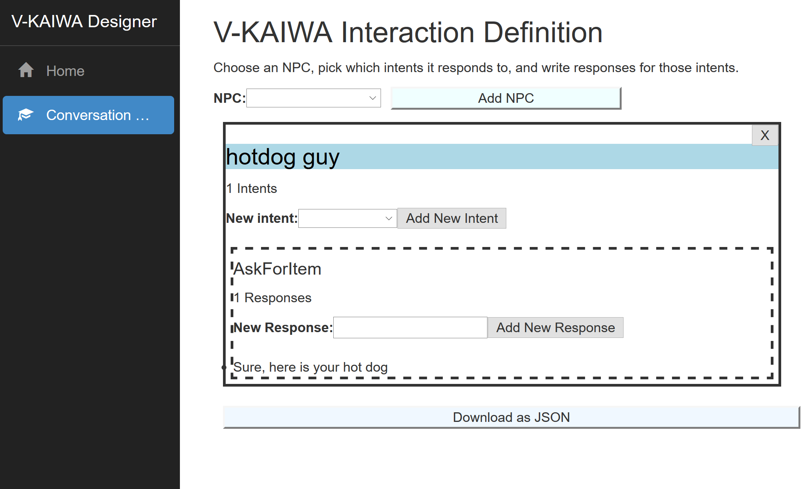

# V-KAIWA Designer

V-KAIWA designer is build using [ASP.NET Core](https://docs.microsoft.com/en-us/aspnet/core/) and [ReactJS](https://reactjs.org/)



## Set up your Development Environment

### Install Visual Studio 2017 with Dotnet Core

 - [Download](https://docs.microsoft.com/en-us/visualstudio/install/install-visual-studio) VS2017 and install.
 - Install the Cross Platform .NET tools including DotNet Core and ASP.NET Core

### Using NVS for NodeJS

Download and install NVS from [here](https://github.com/jasongin/nvs/)

In cmd or powershell, run `nvm add lts`, which downloads the latest long term support node version.

Importantly, then run `nvs link lts`, which adds the lts node binary to the user path.

Check node is installed correctly by opening a new terminal/ cmd and running `node -v`:


```
C:\Users\user>node -v
v8.11.2
```

## Development

Clone this repository: `git clone https://github.com/xtellurian/v-kaiwa-designer`

### Visual Studio 2017

 - Open V-KAIWA-Designer.sln
 - Right-click the V-KAIWA-Designer project and select 'Set as startup project'
 - Run the project in debug mode using F5 - you should run debug mode with IIS, as the docker image doesn't support NodeJS for hot reloads.

 
#### Troubleshooting

 - *I run the project but I get an error about not finding `node`* : Make sure you've followed the instructions above for Using NVS for NodeJS
 - *I try to debug the project in Docker, but it can't find the node binary* : The docker image doesn't have node installed, and it is not required for deployment. Run in IIS instead.


## Deploying via Dockerhub

### Quick Deploy

1. Create a [Web App for Containers](https://docs.microsoft.com/en-us/azure/app-service/containers/tutorial-custom-docker-image).
2. Configure the container by choosing the image from Dockerhub flanagan89/vkaiwadesigner:latest

### Creating a docker image on docker hub

1. Fork this repository
2. Go to [dockerhub](https://cloud.docker.com) and sign up if necessary
3. [Link](https://docs.docker.com/docker-hub/github/) your GitHub account to your docker account. 
4. [Create a new repo](https://docs.docker.com/docker-hub/repos/) on dockerhub, and link to the GitHub repo you forked.
5. [Create an automated build](https://docs.docker.com/docker-hub/github/#creating-an-automated-build).
6. Dockerhub will now build an image of the tool for youo.

### Deploy to an Azure Web App

1. Go to the [Azure Portal](https://portal.azure.com) and sign up if required.
2. Create a [Web App for Containers](https://docs.microsoft.com/en-us/azure/app-service/containers/tutorial-custom-docker-image).
3. Configure the container by choosing the image from Dockerhub <your-docker-username>/vkaiwadesigner:latest
