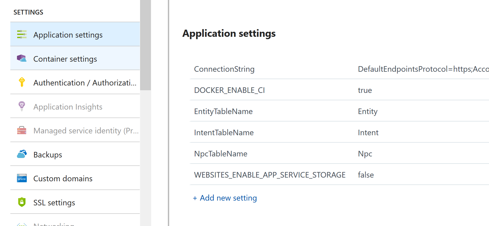

# V-KAIWA Designer

V-KAIWA designer is made with [ASP.NET Core](https://docs.microsoft.com/en-us/aspnet/core/) and [ReactJS](https://reactjs.org/)


## Set up your Development Environment

### Install Visual Studio 2017 with Dotnet Core

 - [Download](https://docs.microsoft.com/en-us/visualstudio/install/install-visual-studio) VS2017 and install.
 - Install the Cross Platform .NET tools including DotNet Core and ASP.NET Core

### Using NVS for NodeJS

Download and install NVS from [here](https://github.com/jasongin/nvs/)

In cmd or powershell, run `nvm add lts`, which downloads the latest long term support node version.

Importantly, then run `nvs link lts`, which adds the lts node binary to the user path.

Check node is installed correctly by opening a new terminal/ cmd and running `node -v`:


```
C:\Users\user>node -v
v8.11.2
```

## Development

Clone this repository: `git clone https://github.com/xtellurian/v-kaiwa-designer`

### Visual Studio 2017

 - Open V-KAIWA-Designer.sln
 - Right-click the V-KAIWA-Designer project and select 'Set as startup project'
 - Run the project in debug mode using F5 - you should run debug mode with IIS, as the docker image doesn't support NodeJS for hot reloads.


### Intents and NPC names during development

The easist way to develop is by using the static list of names in `IntentController` and `NpcController`. If the table name or the connection string is not set in application settings, the app will revert to using those names.
 
#### Troubleshooting

 - *I run the project but I get an error about not finding `node`* : Make sure you've followed the instructions above for Using NVS for NodeJS
 - *I try to debug the project in Docker, but it can't find the node binary* : The docker image doesn't have node installed, and it is not required for deployment. Run in IIS instead.


## Deploying via Dockerhub

### Quick Deploy

1. Create a [Web App for Containers](https://docs.microsoft.com/en-us/azure/app-service/containers/tutorial-custom-docker-image).
2. Configure the container by choosing the image from Dockerhub flanagan89/vkaiwadesigner:latest

### Creating a docker image on docker hub

1. Fork this repository
2. Go to [dockerhub](https://cloud.docker.com) and sign up if necessary
3. [Link](https://docs.docker.com/docker-hub/github/) your GitHub account to your docker account. 
4. [Create a new repo](https://docs.docker.com/docker-hub/repos/) on dockerhub, and link to the GitHub repo you forked.
5. [Create an automated build](https://docs.docker.com/docker-hub/github/#creating-an-automated-build).
6. Dockerhub will now build an image of the tool for you.

### Deploy to an Azure Web App

1. Go to the [Azure Portal](https://portal.azure.com) and sign up if required.
2. Create a [Web App for Containers](https://docs.microsoft.com/en-us/azure/app-service/containers/tutorial-custom-docker-image).
3. Configure the container by choosing the image from Dockerhub <your-docker-username>/vkaiwadesigner:latest


## Configuring Azure Table Storage

Intents and Npcs can be provided to the application from Azure Table Storage. 

*Important!!!* : Do NOT include connection strings in your git repository. Connection string should always remain secret.  

### Setting up an Azure Storage Account

 1. In the [Azure Portal](https://portal.azure.com) create an [Azure Storage Account)[https://docs.microsoft.com/en-us/azure/storage/common/storage-quickstart-create-account] V1
 2. When complete, copy and temporarily save the connection string in the 'Access Keys' tab of the Storage Account in the Portal.

### Adding Intents and NPCs

 1. [Download](https://azure.microsoft.com/en-gb/features/storage-explorer/) and install Azure Storage Explorer.
 2. Open Storage Explorer and sign in with your MS Account (the same as your Azure Portal account)
 3. You should see the storage account you created earlier under your subscription > Storage Accounts.
 3. Right-click on 'Tables' and 'Create Table'. You should create one table for NPCs and one for Intents.
 4. Select a table, and Add Entity by clicking the large + button in the ribbon.
 5. Keep the partition key the same for all intents, and number the row key incrememntally (1,2,3...). [Learn More](https://docs.microsoft.com/en-us/rest/api/storageservices/understanding-the-table-service-data-model) 
 6. Add a Name (string) property to your entity. This is the name of the NPC or Intent. 
 7. Repeat for as many entities as you like. It should look similar to below.


### Configuring the website to use the Storage Account

The web app looks for a connection string and table names in order to read from the Azure Tables. You should provide them via [Application Settings](https://docs.microsoft.com/en-us/azure/app-service/web-sites-configure)



Add three App Settings:

 - *Storage:ConnectionString* = The connection string copied from the Azure Storage Account > Access Keys blade
 - *Storage:IntentTableName* = The name of the table for intents
 - *Storage:NpcTableName* = The name of the table for NPCs
 - *Storage:EntityTableName* = The name of the table for Entities

Now you can add/ remove Intents and NPCs using the Azure Storage Explorer, and the website should update instantly.
